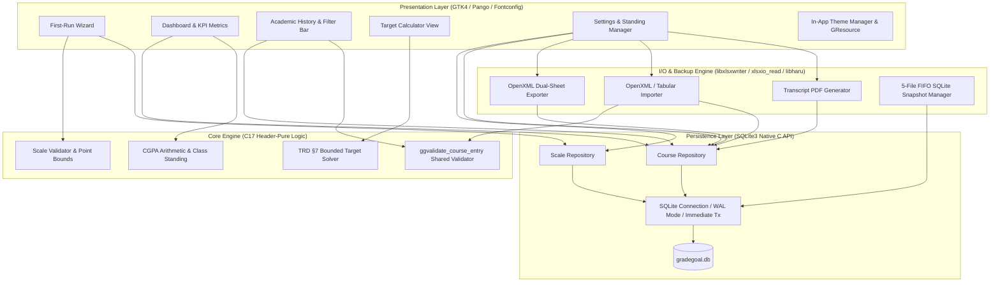

# GradeGoal

> **A modern, high-performance, fully offline C17/GTK4 desktop application that tracks real university CGPA on a configurable scale and deterministically computes the exact grades needed to reach your academic target.**

[](https://github.com/saxrael/GradeGoal/actions/workflows/ci.yml)
[](https://en.cppreference.com/w/c/17)
[](https://www.gtk.org/)
[](https://www.sqlite.org/)
[](https://github.com/saxrael/GradeGoal/releases)
[-success)](tests/)
[](tests/)
[](LICENSE)
[-purple.svg)](AGENTS.md)

---

## 📋 Table of Contents

- [System Architecture & Core Principles](#-system-architecture--core-principles)
- [Key Features](#-key-features)
- [Technology Stack](#-technology-stack)
- [Repository Structure](#-repository-structure)
- [Database & Persistence Layer](#-database--persistence-layer)
- [Target-CGPA Solver Algorithm](#-target-cgpa-solver-algorithm)
- [Local Quick Start & Build Guide](#-local-quick-start--build-guide)
- [Automated Testing & Quality Gate](#-automated-testing--quality-gate)
- [Cross-Platform Packaging & CI/CD](#-cross-platform-packaging--cicd)
- [Security & Architectural Red-Lines](#-security--architectural-red-lines)
- [License & Attributions](#-license--attributions)

---

## 🏗️ System Architecture & Core Principles

GradeGoal is engineered as a strictly decoupled, modular C17 system adhering to separation of concerns across four foundational layers. The Core Engine contains zero GUI or database dependencies, allowing thorough verification via standalone headless unit test suites.



### Core Invariants

1. **Dynamic Derived Aggregate Invariant:** Total Credit Points (TCP) and Total Credit Units (TCU) are **never stored as static table columns**. They are derived on-the-fly via native SQL aggregation queries (`SUM(credit_unit * grade_point)`) across course history and baseline transfer standing. This mathematically guarantees that totals never drift or become stale.
2. **Shared Validation Parity:** Every row imported from a spreadsheet passes through the exact same C validation function (`ggvalidate_course_entry()`) used for manual GUI form input, guaranteeing complete data integrity.
3. **Scale Edit Confirmation Protocol:** Any modification to a grading scale point value requires calculating before-and-after CGPA impacts and presenting an explicit confirmation dialog before committing transactions.
4. **Hard Zero Comments Rule:** All project source code contains zero inline, block, or docstring comments. The codebase expresses intent purely through disciplined type design, descriptive symbol nomenclature, and clean architecture.
5. **Closed Dependency List:** The system depends strictly on an approved closed list of libraries (GTK4, SQLite3, libxlsxwriter, xlsxio_read, libharu, and Unity for testing).

---

## ⚡ Key Features

- 🎯 **Target-CGPA Solver:** Turn *"What grades do I need for a First Class?"* into an exact answer. Input upcoming courses and credit units; the engine computes whether the target is achievable and details the minimum required average and greedy grade assignments.
- 📊 **Real-Time Cumulative CGPA Dashboard:** Interactive KPI cards highlighting Current CGPA, Total Credit Points (TCP), Total Credit Units (TCU), and official Degree Classification Standing.
- 🎓 **Configurable Grading Scales:** Full support for standard 5.0 scales (A=5.0 to F=0.0) or custom institutional scales with arbitrary grade symbols and numeric point allocations.
- 🔄 **Dynamic Prior Standing Management:** Seamlessly input, update, or reset transfer credits and baseline TCP/TCU standing at any point without disrupting existing semester coursework.
- 📁 **Dual-Sheet OpenXML (.xlsx) Round-Trip:** Export full academic records into standard `.xlsx` workbooks containing discrete `Scale` and `History` sheets via `libxlsxwriter`. Re-import anytime via `xlsxio_read` with row-by-row validation.
- 📄 **Executive PDF Transcripts:** Generate multi-page, formatted vector PDF academic summaries featuring cumulative standings, institutional scales, and semester breakdowns via `libharu`.
- 💾 **Rolling 5-File FIFO Backups:** Automated, non-blocking SQLite snapshot creation on every write transaction with automatic 5-slot FIFO pruning in the `backups/` directory.
- 🎨 **Adaptive High-Contrast UI:** Built with GTK4 and custom CSS featuring WCAG AAA contrast ratios, smooth vertical scrolling, dark/light theme auto-switching, and embedded open-source typography (Plus Jakarta Sans & Source Serif 4).
- 🔒 **100% Offline & Private:** Zero network requests, zero telemetry, zero analytics, zero AI/LLM components, and zero external socket bindings. All data remains exclusively on the student's local workstation.

---

## 🛠️ Technology Stack

| Layer | Technology | License | Purpose |
|---|---|---|---|
| **Language** | C17 (ISO/IEC 9899:2018) | Standard | High-performance, portable, memory-efficient systems language |
| **Desktop GUI** | GTK 4.0+ / Pango / Cairo | LGPL v2.1+ | Cross-platform desktop interface, native layout, and typography |
| **Asset Engine** | GLib GResource & Fontconfig | LGPL v2.1+ | In-memory compiled SVG/PNG icon bundles and private font registration |
| **Typography** | Plus Jakarta Sans & Source Serif 4 | SIL OFL 1.1 | High-legibility UI body type and editorial serif numbers |
| **Persistence** | SQLite 3 (Native C API) | Public Domain | Embedded relational ACID storage, WAL mode, immediate write locking |
| **Spreadsheet Export**| libxlsxwriter (Vendored) | FreeBSD | OpenXML PKZIP Deflate dual-sheet workbook generator |
| **Spreadsheet Import**| xlsxio_read (Vendored) | MIT | OpenXML sheet parser and streaming cell reader |
| **Vector PDF Export** | libharu / libhpdf (Vendored) | zlib/libpng | Vector PDF document generator for academic transcripts |
| **Compression** | zlib 1.2+ / 1.3+ | zlib License | Raw Deflate compression engine for OpenXML zip packaging |
| **Test Framework** | Unity (ThrowTheSwitch) | MIT | Lightweight C unit test runner for headless automation |
| **Build System** | CMake 3.16+ & Ninja / Make | BSD-3-Clause | Multi-platform build orchestrator and compiler flag manager |

---

## 📁 Repository Structure

```
GradeGoal/
├── assets/                          # Embedded application assets
│   ├── fonts/                       # PlusJakartaSans & SourceSerif4 (SIL OFL)
│   ├── icon/                        # High-resolution master icons, ICO, ICNS, XDG hicolor
│   ├── theme/                       # Modern high-contrast CSS (gradegoal-light/dark.css)
│   └── gradegoal.gresource.xml      # GLib binary resource bundle descriptor
├── packaging/                       # Cross-platform installer & bundler recipes
│   ├── linux/                       # AppImage packaging script & desktop entry
│   ├── macos/                       # macOS DMG bundler & Info.plist
│   └── windows/                     # Inno Setup (.iss) recipe & DLL harvester scripts
├── platform/                        # OS integration sources
│   ├── linux/gradegoal.desktop      # XDG FreeDesktop launcher
│   └── windows/app.rc               # Windows PE resource script (icons & metadata)
├── src/
│   ├── core/                        # Pure C17 logic (no GTK/SQLite dependencies)
│   │   ├── cgpa_calculator.c/.h     # Precision CGPA calculation
│   │   ├── course_list.c/.h         # Course entity array structures
│   │   ├── gg_types.h               # Core domain types & GGStatus definitions
│   │   ├── scale_validator.c/.h     # Grading scale validation logic
│   │   └── target_solver.c/.h       # TRD §7 combinatorial target solver
│   ├── gui/                         # GTK4 user interface components
│   │   ├── app.c/.h                 # GtkApplication lifecycle & activation
│   │   ├── dashboard_widget.c/.h    # KPI overview & quick-add dialog
│   │   ├── first_run_wizard.c/.h    # Initial grading scale setup onboarding
│   │   ├── gg_theme.c/.h            # GResource theme loading & dark mode listener
│   │   ├── history_widget.c/.h      # Course history table, filtering, & course editor
│   │   ├── main_window.c/.h         # Top-level window, header bar, and tab routing
│   │   ├── settings_widget.c/.h     # Scale editor, prior standing modal, export/import
│   │   └── target_calculator_widget.c/.h # Target goal-seeking solver interface
│   ├── io/                          # I/O serialization & backup subsystem
│   │   ├── backup_manager.c/.h      # 5-file FIFO SQLite snapshot rotation
│   │   ├── io_types.c/.h            # Shared export/import structures
│   │   ├── pdf_exporter.c/.h        # libharu vector PDF report generator
│   │   ├── xlsx_exporter.c/.h       # OpenXML PKZIP dual-sheet workbook exporter
│   │   └── xlsx_importer.c/.h       # OpenXML dual-mode sheet importer
│   ├── persistence/                 # Native SQLite datastore layer
│   │   ├── course_repository.c/.h   # Course CRUD, live totals queries, transactions
│   │   ├── scale_repository.c/.h    # Scale CRUD & point lookup queries
│   │   ├── sqlite_connection.c/.h   # Connection pool, WAL mode, pragmas
│   │   └── sqlite_error.c/.h        # SQLite error mapping
│   └── main.c                       # Application bootstrap entry point
├── tests/
│   ├── integration/                 # SQLite repository & persistence adversarial tests
│   └── unit/                        # Core engine, solver, backup, & I/O test suites
├── third_party/                     # Pinned vendor libraries
│   ├── libharu/                     # PDF generation library
│   ├── libxlsxwriter/               # OpenXML workbook writer
│   ├── xlsxio/                      # OpenXML reader (read-half only linked)
│   └── Unity/                       # Unity test framework
├── tools/                           # Pre-flight compliance & verification scripts
│   ├── check_zero_comments.ps1      # PowerShell zero comments auditor
│   └── check_zero_comments.sh       # Bash zero comments auditor
├── CMakeLists.txt                   # Root CMake build definition
└── README.md                        # Project documentation
```

---

## 🛢️ Database & Persistence Layer

GradeGoal utilizes a local SQLite database (`gradegoal.db`) configured for maximal reliability, zero corruption, and concurrency safety:

```sql
PRAGMA journal_mode = WAL;
PRAGMA foreign_keys = ON;
PRAGMA synchronous = NORMAL;
```

### Relational Schema

```sql
CREATE TABLE IF NOT EXISTS scale (
    grade_symbol TEXT PRIMARY KEY,
    grade_point  REAL NOT NULL CHECK (grade_point >= 0.0)
);

CREATE TABLE IF NOT EXISTS courses (
    id             INTEGER PRIMARY KEY AUTOINCREMENT,
    semester_label TEXT NOT NULL,
    course_label   TEXT NOT NULL,
    credit_unit    INTEGER NOT NULL CHECK (credit_unit > 0),
    grade_symbol   TEXT NOT NULL REFERENCES scale(grade_symbol)
                   ON UPDATE CASCADE ON DELETE RESTRICT,
    entry_date     TEXT NOT NULL
);
```

### Dynamic Derived Aggregate Query

In strict compliance with architectural invariants, Total Credit Points (TCP) and Total Credit Units (TCU) are queried dynamically at runtime:

```sql
SELECT 
    COALESCE(SUM(c.credit_unit * s.grade_point), 0.0) AS total_points,
    COALESCE(SUM(c.credit_unit), 0) AS total_units
FROM courses c
JOIN scale s ON c.grade_symbol = s.grade_symbol;
```

---

## 🎯 Target-CGPA Solver Algorithm

The target CGPA calculation in [`src/core/target_solver.c`](src/core/target_solver.c) implements the deterministic 3-branch bounded search algorithm defined in TRD §7:

$$\Delta\text{TCU} = \sum_{i=1}^{n} \text{unit}_i$$

$$\text{RequiredPoints} = \text{TargetCGPA} \times (\text{CurrentTCU} + \Delta\text{TCU}) - \text{CurrentTCP}$$

$$\text{MaxAchievablePoints} = \Delta\text{TCU} \times \text{Scale}_{\text{max}}$$

$$\text{MinAchievablePoints} = \Delta\text{TCU} \times \text{Scale}_{\text{min}}$$

### Solver Branches:

1. **Branch 1: Mathematically Impossible**
   - Condition: $\text{RequiredPoints} > \text{MaxAchievablePoints}$
   - Output: Reports maximum reachable CGPA:
     $$\text{MaxCGPA} = \frac{\text{CurrentTCP} + \text{MaxAchievablePoints}}{\text{CurrentTCU} + \Delta\text{TCU}}$$
2. **Branch 2: Already Guaranteed**
   - Condition: $\text{RequiredPoints} \le \text{MinAchievablePoints}$
   - Output: Confirms that even if the student scores the minimum passing grade in all upcoming courses, the target CGPA is already met.
3. **Branch 3: Achievable with Target Average**
   - Condition: $\text{MinAchievablePoints} < \text{RequiredPoints} \le \text{MaxAchievablePoints}$
   - Output: Computes required average grade point:
     $$\text{ReqAvg} = \frac{\text{RequiredPoints}}{\Delta\text{TCU}}$$
   - Greedy Assignment: Courses sorted by credit unit descending; starting at the minimum scale grade, the solver incrementally upgrades courses with the highest credit units until the required point threshold is fulfilled.

---

## 🚀 Local Quick Start & Build Guide

### Prerequisites

#### Windows (MSYS2 MinGW-w64)
```powershell
pacman -Syu
pacman -S --noconfirm mingw-w64-x86_64-gcc mingw-w64-x86_64-cmake mingw-w64-x86_64-ninja `
                      mingw-w64-x86_64-gtk4 mingw-w64-x86_64-sqlite3 mingw-w64-x86_64-zlib `
                      mingw-w64-x86_64-expat mingw-w64-x86_64-libpng
```

#### Ubuntu / Debian
```bash
sudo apt-get update
sudo apt-get install -y build-essential cmake ninja-build \
                        libgtk-4-dev libsqlite3-dev zlib1g-dev \
                        libexpat1-dev libpng-dev clang-format xvfb
```

#### macOS (Homebrew)
```bash
brew install cmake ninja pkg-config gtk4 sqlite zlib expat libpng
```

---

### Building from Source

```bash
# 1. Clone repository
git clone https://github.com/saxrael/GradeGoal.git
cd GradeGoal

# 2. Configure build with CMake
cmake -B build -G Ninja -DCMAKE_BUILD_TYPE=Release

# 3. Compile application and test targets
cmake --build build --config Release

# 4. Launch GradeGoal
./build/bin/GradeGoal
```

---

## 🧪 Automated Testing & Quality Gate

GradeGoal enforces a strict verification pipeline. Every change is tested across 12 distinct unit and integration test suites covering edge cases, bounded conditions, and adversarial inputs:

```bash
# Execute entire test suite via CTest
ctest --test-dir build --output-on-failure -C Release
```

### Test Suite Coverage

| Target | Category | Description |
|---|---|---|
| `test_scale_validator` | Unit | Validation of grade symbol uniqueness, positive points, bounds |
| `test_cgpa_calculator` | Unit | Precision floating-point CGPA calculation and class standing |
| `test_target_solver` | Unit | TRD §7 algorithm across all 3 branches and greedy assignments |
| `test_adversarial_m1` | Unit | Boundary stress testing on scale configuration and solver |
| `test_adversarial_m1_challenger2` | Unit | Malformed and extreme boundary inputs |
| `test_sqlite_repositories` | Integration | Scale and course CRUD, live derived queries, cascading constraints |
| `test_adversarial_m2` | Integration | Transaction rollbacks, constraint violations, and thread-safety |
| `test_adversarial_m2_challenger2`| Integration | SQLite stress-testing with foreign-key enforcement |
| `test_backup_manager` | Unit | 5-file FIFO snapshot creation, rotation, and file pruning |
| `test_xlsx_exporter` | Unit | OpenXML dual-sheet workbook structure and XML compliance |
| `test_xlsx_importer` | Unit | Dual-mode parsing, corrupted file handling, and row revalidation |
| `test_pdf_exporter` | Unit | PDF transcript formatting and multi-page layout generation |

### Memory Leak & Sanitizer Audits

```bash
# Configure with AddressSanitizer and UndefinedBehaviorSanitizer
cmake -B build-asan -G Ninja -DENABLE_ASAN=ON -DCMAKE_BUILD_TYPE=Debug
cmake --build build-asan
ctest --test-dir build-asan --output-on-failure

# Execute Valgrind Memcheck (Linux)
valgrind --leak-check=full --show-leak-kinds=all --error-exitcode=1 ./build/bin/test_target_solver
```

### Pre-Commit Audits

```bash
# 1. Hard Zero Comments Audit
# On Windows:
powershell -ExecutionPolicy Bypass -File tools/check_zero_comments.ps1
# On Linux/macOS:
bash tools/check_zero_comments.sh

# 2. Clang-Format Verification (0 violations required)
find src tests \( -name '*.c' -o -name '*.h' \) | xargs clang-format --dry-run --Werror
```

---

## 🚢 Cross-Platform Packaging & CI/CD

GradeGoal features automated continuous integration and multi-platform distribution pipelines configured in [`.github/workflows/ci.yml`](.github/workflows/ci.yml).

### Packaging Workflows

- **Windows (Inno Setup Installer & Portable ZIP):**
  - Automates dynamic dependency harvesting using MSYS2 and `ntldd`.
  - Packages complete runtime dependencies (GTK4 runtime, GIO modules, Pango, Pixbuf loaders, schemas).
  - Compiles native Inno Setup installer (`GradeGoal_Setup_Windows_x64.exe`) and portable standalone ZIP.
- **Linux (AppImage & Tarball):**
  - Bundles shared libraries, XDG desktop metadata, and high-resolution icons into a standalone portable AppImage (`GradeGoal-x86_64.AppImage`).
- **macOS (DMG Bundle):**
  - Bundles dependencies via `dylibbundler` and produces a signed drag-and-drop disk image (`GradeGoal_macOS.dmg`).

---

## 🔒 Security & Architectural Red-Lines

> [!CAUTION]
> GradeGoal is built with strict, permanent architectural boundaries that may not be bypassed:

- **Zero AI / ML / LLM Components:** No artificial intelligence, OCR engines, neural networks, or LLM integrations are permitted in this codebase. All calculations are 100% deterministic arithmetic.
- **Strict Offline Operation:** The application performs zero network requests, binds no network sockets, and includes no cloud dependencies.
- **Zero Static Running Totals:** TCP and TCU must never be written to static database columns.
- **Input Validation Parity:** Excel import records must strictly pass through `ggvalidate_course_entry()`.
- **Zero Comments Enforcement:** No comments are allowed in source code. Code must remain completely self-documenting.
- **Closed Dependency List:** No unapproved third-party dependencies may be added.

---

## 📄 License & Attributions

GradeGoal is licensed under the **[MIT License](LICENSE)** with dynamic linking to **GTK4** under **LGPL v2.1+**:

- **GTK4**: Licensed under [LGPL v2.1+](https://www.gnu.org/licenses/old-licenses/lgpl-2.1.html). Dynamically linked.
- **SQLite**: Dedicated to the [Public Domain](https://www.sqlite.org/copyright.html).
- **libxlsxwriter**: Copyright (c) John McNamara, licensed under the [FreeBSD License](https://github.com/jmcnamara/libxlsxwriter/blob/master/License.txt).
- **xlsxio**: Copyright (c) Brecht Sanders, licensed under the [MIT License](https://github.com/brechtsanders/xlsxio/blob/master/LICENSE.txt).
- **libharu**: Copyright (c) Takeshi Kanno, licensed under the [ZLIB/LIBPNG License](https://github.com/libharu/libharu/blob/master/LICENSE).
- **Unity**: Copyright (c) ThrowTheSwitch.org, licensed under the [MIT License](https://github.com/ThrowTheSwitch/Unity/blob/master/LICENSE.txt).
- **Plus Jakarta Sans**: Copyright (c) Tokotype, licensed under the [SIL Open Font License 1.1](http://scripts.sil.org/OFL).
- **Source Serif 4**: Copyright (c) Adobe Systems Incorporated, licensed under the [SIL Open Font License 1.1](http://scripts.sil.org/OFL).

Developed with architectural precision by **Israel Ayeni**.
